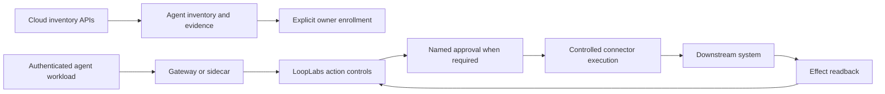

# Cloud agent discovery and execution enforcement

October 9, 2026. Raj added cloud discovery and sidecar-based enforcement to the
platform scope. This document is the implementation contract, not a shipped
integration claim. Current LoopLabs controls operate enrolled identities and
bounded private provider twins. No AWS, Azure or Google discovery connector,
credential broker or customer-side enforcement sidecar is established yet.

## Product journey

An invited administrator connects an explicitly scoped cloud account/project,
reviews discovered agents and unresolved evidence, assigns accountable owners,
and enrolls selected actions into LoopLabs controls. Inventory must show exactly
which actions are observable and which have a verified enforcement path.

Discovery never grants execution authority. Agent names, tags, role names, tool
schemas and telemetry are untrusted evidence, not authorization. A caller cannot
become a discovered agent by sending its ID in a header.

The intended control loop is:

## Cloud adapter scope

| Adapter | Initial discovery | Identity/authority evidence | Enforcement integration to prove |
| --- | --- | --- | --- |
| AWS | AgentCore runtime list/detail, gateway targets; Bedrock Agents as a separate adapter | Runtime role and workload identity references; explicitly scoped IAM policy evidence | Controlled MCP/tool gateway or SDK wrapper; federation for approved downstream access |
| Microsoft Azure | Foundry agents, versions, deployments and configured tools in explicitly enrolled projects | Entra principal references and separately read role assignments | Tool endpoint or API gateway integration authenticated with the workload identity |
| Google Cloud | Agent Engine resource list/detail in enrolled projects/locations; other agent products require separate adapters | Agent principal/service account plus separately retrieved policy evidence | Controlled tool endpoint/gateway with approved workload federation |
| Other/custom | Reviewed manifest and authenticated registration; optional deployment inventory adapter | Attested workload plus explicit owner enrollment | SDK wrapper, MCP gateway or customer-side sidecar |

Cloud APIs cannot enumerate every agent hidden inside arbitrary applications or
container code. A discovered runtime does not automatically expose its complete
tool graph, actual behavior or effective permissions. Roles alone omit conditions,
resource policies, inherited restrictions, session grants and downstream SaaS
permissions. Represent those as unresolved evidence, not unrestricted access or a
complete authorization analysis. Metadata labels such as owner are declared until
confirmed by an invited administrator.

Each normalized record needs tenant, connection, cloud scope, stable resource ID,
version, identity references, declared tools/actions, evidence source, observed time,
collection completeness, unresolved fields, accountable owner and control coverage.
Store allowlisted metadata only. Runtime responses can contain environment values;
never save raw response objects, tokens, credential values or prompt/customer data.

Collection must bind authenticated account/project identity to the enrolled scope,
validate returned resource scope, exhaust bounded pagination, detect repeated tokens,
and record failures/throttling. An incomplete scan cannot erase prior agents or claim
zero agents. Removed resources need a complete confirmed scan or a direct verified
absence; snapshots preserve history. Policy drift invalidates affected enrollment
until reviewed. Exact trust/policy semantics remain provider-specific.

## Three execution paths

1. A tool/MCP gateway is the first path: existing agents call controlled tool
   endpoints. LoopLabs authenticates the caller and evaluates the exact proposed
   method, destination and body before its connector makes the request.
2. An SDK/tool wrapper explicitly submits actions and polls durable decisions.
   This is easiest for custom agents, but bypass tests and removal of independent
   downstream credentials are still necessary to claim enforced coverage.
3. A customer-side sidecar/gateway is suitable for managed containers or services.
   It authenticates its local workload, submits normalized action envelopes and
   executes only approved connector calls. A network proxy cannot inspect arbitrary
   encrypted payloads. Prefer explicit tool/API integration; do not silently install
   TLS interception or claim semantic control from network destination alone.

A service-mesh external-authorization hook can provide synchronous allow/deny, but
is not by itself a durable human-approval workflow or provider verification service.
An approval hold should return a saved action ID, not keep an HTTP request open
indefinitely. Resumption uses the same ID and revalidates current identity, payload,
policy, source state, budget and approval before execution.

## Identity, credentials and bypass containment

Use a deployment-attested identity (cloud workload federation or SPIFFE where
appropriate), with issuer, audience, tenant, expiry and revocation validation.
LoopLabs membership, cloud workload identity and connector credentials are distinct.
A sidecar must not scrape process credentials or receive a general cloud-admin key.

A broker may exchange a validated workload identity for short-lived, narrowed
provider credentials under an explicitly provisioned trust relationship. Token
issuance is not exact-action enforcement: cloud tokens commonly permit multiple
calls. Prefer keeping downstream credentials inside the controlled executor. Bind
LoopLabs authorization to the immutable action and enforce it at the call boundary.
Credentials stay out of plans, metadata, logs and browser storage.

To claim enforcement, prove that direct downstream access is denied: remove old
agent credentials and constrain egress/provider trust to the controlled path.
Network policy must account for the shared network namespace of Kubernetes sidecars;
a per-pod allowlist alone may not distinguish agent and sidecar processes. Identity,
credential separation and actual bypass probes are required. Customer root/node
administrators and cloud administrators remain explicit trusted boundaries.

On control-service outage, stale identity or missing evidence, mutating calls deny
or remain durably held. No fail-open fallback. Read-only observation can be deployed
first, but must be labeled observation. Decision logs bind tenant, workload, action,
policy/approval versions, request hash, outcome and provider reference with data
minimization. A log of a request is not proof of its effect.

## Build and acceptance order

- Implement normalized evidence/coverage and the AWS read-only adapter first;
  validate pagination, cross-account refusal, secret redaction, partial scans and
  permission loss against dedicated fixtures, then one authorized cloud account.
- Add invited connection/enrollment UX and durable snapshot history; no cloud policy
  mutation during discovery. Request the exact scoped trust configuration only when
  the adapter and reviewable onboarding instructions are ready.
- Prove one authenticated tool gateway/sidecar over the existing CRM-to-message
  workflow: permitted action, policy block, independent approval, payload change,
  duplicate, expiry, revoked identity, control outage, lost response and restart.
- Independently attempt direct downstream access, wrong-workload substitution and
  cross-tenant calls. Require zero effects for denied paths and independent readback
  for permitted effects before labeling the connection enforced.
- Add Azure and Google adapters using the same evidence contract but their actual
  identity and API semantics. No generic all-cloud parity promise.

The disposable reset/archive trial now passes, with its exact scope recorded in
`RESET_ASSEMBLY_BOOTSTRAP.md`. Cloud discovery must preserve those covered sources
or require fresh evidence, and must not automatically migrate production dispatch.
Production release remains clean pushed main, full quality/CI and `./deploy.sh`.

## Primary references checked October 9

- AWS runtime detail API (role/workload identity; response also includes environment values): https://docs.aws.amazon.com/bedrock-agentcore-control/latest/APIReference/API_GetAgentRuntime.html
- AWS runtime listing/pagination: https://docs.aws.amazon.com/bedrock-agentcore-control/latest/APIReference/API_ListAgentRuntimes.html
- AWS control APIs, including gateway targets: https://docs.aws.amazon.com/bedrock-agentcore-control/latest/APIReference/API_Operations.html
- AWS gateway authorization and tool entry point: https://docs.aws.amazon.com/bedrock-agentcore/latest/devguide/gateway-core-concepts.html
- Foundry agent configuration and instance identity: https://learn.microsoft.com/en-us/azure/foundry/agents/how-to/configure-agent
- Foundry agent identity and downstream tools: https://learn.microsoft.com/en-au/azure/foundry/agents/concepts/agent-identity
- Google agent identity/registry/gateway overview: https://docs.cloud.google.com/iam/docs/agent-identity-overview
- Google reasoning engine list permission: https://docs.cloud.google.com/vertex-ai/generative-ai/docs/reference/rpc/google.cloud.aiplatform.v1
- AWS short-lived federation credentials: https://docs.aws.amazon.com/STS/latest/APIReference/API_AssumeRoleWithWebIdentity.html
- SPIFFE workload identity specification: https://spiffe.io/docs/latest/spiffe-specs/spiffe_workload_api/
- Envoy external authorization and failure behavior: https://www.envoyproxy.io/docs/envoy/v1.30.2/api-v3/extensions/filters/http/ext_authz/v3/ext_authz.proto

These sources establish integration surfaces, not evidence that LoopLabs has
implemented or secured them. Availability, preview status and permissions must be
checked again when each provider adapter is implemented.

## Read-only collection foundation candidate

`lib/workspace/cloud-discovery.ts` adds an API-client interface and allowlisted AWS
AgentCore runtime collection model. It checks the enrolled caller account, runtime
ARN/account/region, exact listed version and bounded pagination before retaining
resource and identity references. Raw runtime detail objects can contain environment
values; those objects, descriptions, headers and raw errors are never returned.
Unknown effective permissions and tools remain explicit gaps. Collection creates
no agent, credential, record grant, approval or execution request.

Partial, cyclic, malformed, throttled and page-limited scans remain incomplete.
The separate evidence merge retains prior resource/version observations even when
the next API traversal returns nothing; absence is not deletion or revocation.
Stored evidence cannot inject authority, hide gaps or carry extra raw metadata.
Input scope is copied before the first asynchronous operation.

The tests use native-shaped API fixtures, including hostile metadata and failures.
No signed native AWS client, real cloud-account scan, database snapshot persistence,
connection/enrollment UI, MCP/A2A import or customer-side enforcement is wired yet.
This is the shared collection foundation, not a working enterprise cloud pilot.
