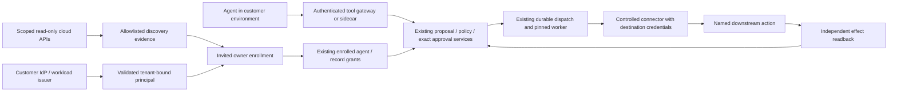

# Enterprise agent pilot: current-state review

October 9, 2026. Review of Raj's FetchSandbox proposal against candidate branch
`codex/looplabs-worker-version-lifecycle`, inventory foundation commit
`0dbba75ed5ddeaef6c0b9cc6297b7fa2d649533a`. This is an acceptance plan, not a
production-readiness statement. The proposal extends the existing control services;
it does not authorize a parallel execution engine or production cutover.

## Baseline and evidence boundary

The inspected remote-main reference is `774dd8d04cdcf7839f793f4e743a03119cdd4c49`.
Branch implementation, accepted disposable proof and production deployment are
different facts. This review has not independently inspected the production schema,
image identities or provider configuration; deployed coverage remains unverified
here. Production is not authorized to switch dispatch ownership in this phase.

Local full quality and normal pre-push quality passed 535 tests across 96 files
and 52 rendered internal destinations for the inventory candidate; all three
exact-head CI jobs in run `37934221392` also passed. Those checks
do not prove a cloud connection, live destination enforcement or enterprise SSO.
Accepted drain trial `37911844347` covers actual worker loss/recovery, two distinct
worker artifacts, correct replay/incompatible replay refusal, outbox admission
races, named approvals and typed HTTPS/mobile operation with private twins. Its
113 source fingerprints remain unchanged. Earlier reset/archive trials remain
failed. Corrected run `37932460184` passed the actual reset/archive assembly,
following quality gate and cleanup. Its retained receipt covers 129 current source
fingerprints, one reset RPC, fresh-process duplicate refusal, four unchanged effects
and restored containment of 12 actions across two draining builds. See
[RESET_ASSEMBLY_BOOTSTRAP.md](RESET_ASSEMBLY_BOOTSTRAP.md). This closes a disposable
assembly gap, not persistent operations or live provider readiness.

## Proposal coverage matrix

| Requirement | Current implementation and evidence | Gap / extension and acceptance |
| --- | --- | --- |
| 1. Reuse current platform | `ConnectorControl`, workflow guards, enquiry submission, immutable requests, record grants, Temporal outbox/activities and provider readback already form one controlled path. See `lib/connectors/service.ts`, `lib/workflows/guard.ts`, `lib/enquiries/submission.ts`, `runtime/temporal/`. | Add discovery/enrollment and caller identity at existing boundaries. Do not introduce a second dispatch, approval or effect journal. Deployment facts need separate inspection. |
| 2. Native discovery | `registerAgentIn` manually creates a scoped agent, profile and token. Record onboarding is an administrator-configured private catalog, not agent discovery. `cloud-discovery.ts` now adds an injected read-only AWS runtime collector and strict inventory preservation, with ten adversarial tests. No signed native client, stored inventory or discovery UI is wired. | Read-only provider adapters, scoped immutable snapshots, version/tool/schema evidence, pagination/completeness/freshness and explicit unknowns. No discovery path calls registration or issues a token. Partial scans cannot erase prior agents. |
| 2. MCP/A2A | No production MCP discovery adapter or A2A import was established in the inspected implementation. | Treat MCP `tools/list` as declared capability evidence; A2A cards as declared service capabilities. Neither proves internal tools, effective permissions or enforceability. Restrict authenticated endpoints and outbound destinations; schemas/descriptions remain untrusted data. |
| 2. Coverage presentation | Existing directory exposes enrolled agents and tools; existing run presentation distinguishes verified, pending and uncertain outcomes. | Inventory shows independent facts: discovered, ownership mapped, activity connected, enforcement verified for one named action. Enforcement is not an agent-wide badge. Missing telemetry is unknown, not zero activity. |
| 3. Human/workload identity | `lib/workspace/auth.ts` provides invited passwords and hashed eight-hour sessions. `identity.ts` checks active members/current sessions. `lib/durable/service.ts` checks active scoped tokens again. | Enterprise IdP mapping and lifecycle integration are absent. Separate employee, guest/contractor, company workload and partner-agent principals. Local token schema has no expiry; do not call it federated short-lived identity. |
| 3. Roles and destination permissions | Named operators, scoped agents and enquiry workers are separate. Agents cannot approve/execute/configure. All named members currently receive the operator role. | Split workspace administration, connection administration, business approval and observation. An administrator must not inherit CRM/data access. IdP groups require reviewed mappings rather than automatic grants. |
| 3. Offboarding and drift | `managedOwnerActive` checks the managed plan creator before connector dispatch; approvals check active approvers; policy/grant changes invalidate old approvals. Restore epoch/quarantine contains restored authority. | This is not universal profile-owner offboarding: unmanaged actions do not necessarily check `ll_agent_profiles.owner`. Define personal delegation suspension versus explicitly reassigned company jobs. Reactivation must not revive old work. Legacy operator-token compatibility in `activeApprover` requires explicit lifecycle treatment. Test owner, approver, workload and connection revocation independently. |
| 3. Revocation latency | Current database authority is queried during consequential attempts and after provider calls. Already sent requests may complete and remain uncertain. | No measured end-to-end IdP-to-provider revocation bound exists. Measure event/poll ingestion, cache lifetime and in-flight exposure. State the observed delay; never promise recall of an already accepted action. |
| 4. Exact action controls | Saved connector snapshots bind method/resource/body/source condition/destination; `valid`, workflow guards and record-grant versions recheck current authority, policy and independent 15-minute approval. | Enroll one actual partner action and workload version. Map discovery identity to enrolled identity explicitly; preserve upstream and downstream resource permissions. No caller-supplied agent ID establishes identity. |
| 4. Mandatory path / sidecar | Private fixture credentials belong to trusted execution; current HTTP agent APIs accept scoped registered callers. No customer-side sidecar, federated broker or actual provider bypass proof exists. | Prove gateway/SDK/sidecar caller identity, exact-request checks and removal of alternate credentials/direct access. A network proxy or cloud token alone is insufficient. If bypass is possible, label monitored/partially protected. |
| 5. Durability and failures | Existing action keys, leases, uncertain-state reconciliation, immutable proposals, dependency checks, one-way outbox ownership, worker pinning/replay and restore containment have bounded component/disposable proofs. | Disposable reset/archive acceptance now passes; complete long-term two-version artifact/history retention and persistent operator recovery. Add real provider rate-limit/retry-contract acceptance, representative sustained operation, alerts and operator resolution. Do not retry an uncertain write merely because evidence is missing. |
| 5. Atomic source-state writes | Private twin enforces the approved CRM version atomically. `HostedFetchSandboxConnectors.write` refuses CRM mutation because the hosted contract lacks that guarantee. | Hosted CRM path remains blocked. Require a destination-supported conditional write or a reviewed action redesign. GET then unconditional PATCH does not close this gap. A new twin capability proves rehearsal semantics, not real HubSpot concurrency. |
| 6. Understandable proof | Saved request/message presentation, independent action approval, provider observations, action events and full-run verification already exist. `runProgress` refuses a completion receipt without both verified effects. | Add version/identity provenance, attempt visibility and discovery gaps to existing views. Human-readable outcome first; technical request evidence expandable. Persist only allowlisted/minimized metadata. Rehearsal and live evidence must remain distinct. |
| 7. Actual UI acceptance | Accepted disposable typed HTTPS/390px journey demonstrates the fixed acknowledgement and named approvals. Existing API/HTTP proofs cover revoked, stale, replay, lost response and tenant refusals within their recorded scope. | Imported cloud agent journey and direct-provider bypass tests are absent. Extend the actual journey from connected account to selected action, with independent provider evidence and current source fingerprints; scripted fixtures cannot substitute for cloud enrollment UI. |

The shared runtime database role still has cross-company row visibility and can
update operational fields. Application tenant checks and the restricted-role proof
do not establish database row isolation or protection from a compromised service.
Independent security assessment and a reviewed tenant isolation strategy remain
required. Event mutation restrictions do not make receipts independently signed.

## Trust boundaries to preserve

Inventory cannot grant execution. IdP authentication cannot grant business approval.
The model cannot grant either. Gateway credentials, connector credentials, human
sessions and migration-owner authority remain distinct. Temporal schedules work;
LoopLabs rechecks business authority and effect evidence. Administrative/root
access to customer hosts and the database remains an explicit trusted boundary.

## Implementation order and reuse

1. Preserve the accepted drain and reset/archive receipts and their covered sources.
   Retain the exact two worker artifacts/histories
   and prove fresh retrieval before operational acceptance. No production cutover.
2. Wire the tested shared read-only inventory collector to a signed AWS client,
   durable snapshots and reviewed enrollment as the first integration candidate. AWS is an engineering starting point, not a claim
   about any partner's stack. Confirm partner platform/action before a live pilot.
   Keep discovery storage separate from `ll_agents` authority, with explicit links
   only after reviewed enrollment. Add new migrations; preserve applied migrations.
3. Extend existing identity checks with an established customer IdP/workload
   integration and explicit role/lifecycle policy. Apply the check consistently to
   managed and unmanaged selected actions. Block delegated work on offboarding;
   company-owned work needs explicit reassignment/versioning. No silent transfer.
4. Wrap one existing connector action with the authenticated gateway/sidecar path.
   Reuse `ConnectorControl`, exact request snapshots, scope grants, approvals,
   dispatch and reconciliation. The sidecar is an integration boundary, not an
   alternate engine. Keep credentials in the executor and test direct bypass.
5. Prove rehearsal first through the actual inventory/enrollment/control UI. Add
   hosted destination acceptance only when its atomic source-state and outcome
   lookup contracts are established. Otherwise show blocked/unsupported clearly.
6. Complete persistent staging, operator/security review and agreed service/load/
   recovery objectives before offering a live consequential-action pilot. Obtain
   exact scoped trust/access only when implementation and setup are reviewable.

## Required acceptance evidence for the slice

Every row needs a dated, current-source result, actual UI/API path and independent
side-effect readback where applicable. Unknown, blocked and unsupported are valid
results but cannot count as a passing completion.

| Exercise | Required result |
| --- | --- |
| Complete discovery / throttled or failed page / repeated page token | Correct account/project identity and version/tool evidence; incomplete scan preserves prior inventory and visibly states gaps. |
| Import and owner mapping | No execution token, record grant or approval is issued by discovery; explicit reviewed enrollment links one existing agent. |
| Authorized action | Exact named action completes through the controlled connector; effect is read back and displayed. |
| Unauthenticated, wrong workload, wrong tenant/resource | Refusal before provider write; zero independent effects. |
| Self-approval, expired approval, changed payload/destination/policy/grant | Refusal or invalidation; old authority cannot be restored by replay/reactivation. |
| Owner offboarded, contractor expiry, approver/workload revoked | Current authority blocks dispatch; in-flight uncertainty remains visible. Record measured lifecycle propagation delay. |
| Destination data changes after approval | Destination atomically rejects stale write; dependent actions remain held. No read-then-unconditional-write workaround. |
| Duplicate / concurrent dispatch / restart / replay | Stable action/reservation identity and no extra effects; exact compatible worker resumes. |
| Provider accepted response lost / timeout / rate limit | Reconcile accepted effects; unknown remains contained. Retry only under the proven provider contract. |
| Control-service outage and alternate direct credentials/path | No fail-open execution. Independently attempt bypass; coverage is enforced only when it actually refuses. |
| Missing telemetry or stale discovery | Coverage becomes unknown/stale; no inferred completeness or unrestricted permissions. |
| Rehearsal versus live | Clearly different mode and destination; no live fallback or widened credentials. |

## Next decision

The proposal is accepted as an extension of the platform goal. Existing narrow
control primitives should be retained. The current blocker to claiming the whole
pilot ready is missing end-to-end cloud identity/enforcement and operational proof,
not a need to replace the rule/approval/durable execution services. No enterprise
production certification or Temporal superiority is asserted.
